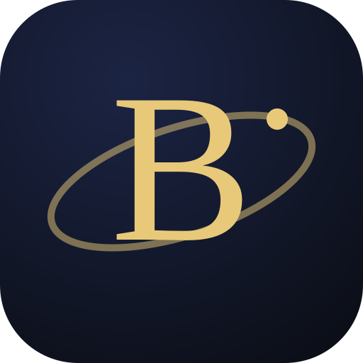
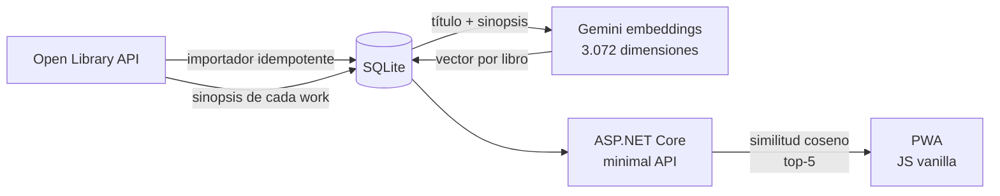

<div align="center">



# BookRadar

**Recomendador semántico de libros — porque las estrellas mienten.**

Un libro de 4,7 ★ puede ser un truño *para ti*, y uno de 3,8 ★ tu próximo favorito.
BookRadar no recomienda por popularidad: recomienda por **significado**.


`ASP.NET Core` · `EF Core + SQLite` · `Gemini embeddings` · `similitud coseno` · `PWA`

</div>

<!-- TODO: captura de pantalla → docs/screenshot.png -->
<!--  -->

## Cómo funciona



1. Un **importador idempotente** puebla el catálogo desde Open Library (~1.300 libros, paginado, con reintentos exponenciales vía Polly).
2. Un **enriquecedor** baja la sinopsis de cada obra (manejando JSON polimórfico: el campo `description` cambia de forma según el registro).
3. Cada libro se convierte en un **vector de 3.072 dimensiones** con `gemini-embedding-2` — libros con *significado* parecido quedan cerca en ese espacio.
4. Recomendar = **similitud coseno** entre el libro que te gustó y todo el catálogo → top 5.
5. Todo se sirve como **API + PWA instalable** desde un único proceso.

## Ejecutarlo

Requisitos: .NET 10 y una API key de [Google AI Studio](https://aistudio.google.com/apikey) (gratis).

```bash
export GEMINI_API_KEY='tu_key'      # en ~/.zshrc para que persista

# 1. Poblar el catálogo y generar embeddings (tarda; la cuota gratis limita ~500/día)
cd BookRadar.App && dotnet run

# 2. Levantar la app
cd ../BookRadar.Api && dotnet run
```

Abre `http://localhost:5000` (o el puerto que indique la consola) y usa el botón
**Instalar** del navegador para tenerla como app de escritorio.

## La ingeniería que hay debajo

- **Idempotencia real**: clave natural de Open Library + índice único en BBDD (el `if` es la cortesía; la *constraint* es el muro contra race conditions).
- **Resiliencia**: reintentos con backoff exponencial (Polly) y *fail-fast* cuando la cuota diaria de embeddings se agota.
- **Lotes largos sin pérdidas**: checkpoints periódicos de `SaveChanges` — un crash en el libro 800 no tira 20 minutos de trabajo.
- **Tests**: xUnit con SQLite in-memory para la persistencia y un `HttpMessageHandler` falso para testear la paginación HTTP sin tocar la red.
- **CI**: GitHub Actions compila y ejecuta la suite en cada push.
- **Secretos fuera del código**: la API key vive en variable de entorno; el repo se escanea antes de cada commit.

## Limitaciones conocidas

- Los títulos llegan en su idioma canónico (casi siempre inglés): limitación del catálogo de Open Library, no del código.
- La cuota gratuita de Gemini limita el embebido a ~500 libros/día (el proceso es reanudable: cada pasada continúa donde quedó).
- Las sinopsis editoriales suelen mencionar al autor → *feature leakage*: el autor se cuela en el vector aunque no esté en la receta.

## Posibles siguientes pasos

- `batchEmbedContents` para embeber 100 libros por petición.
- Chat sobre el catálogo ("recomiéndame algo corto y oscuro para el avión").
- Perfil de gustos persistente (historial de lecturas con valoraciones).

---

Hecho por **Ignacio Dalesio** ([@nacho995](https://github.com/nacho995)) mientras aprendía .NET *de verdad*: tecleando cada error.
